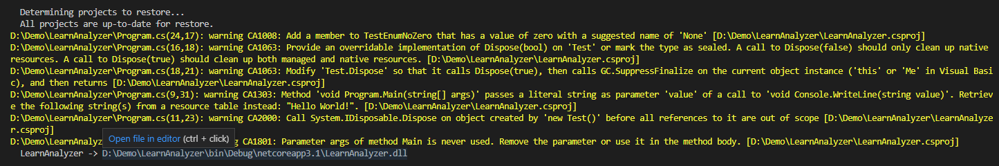

# Mitigating FxCop to Microsoft.CodeAnalysis.NetAnalyzers, no warning or error when use with .NET Core 3.1 SDK

Refer to <https://github.com/dotnet/roslyn-analyzers/issues/5069> for details.

## Symptom

.NET Analyzers' not working for .NET Core 3.1 SDK.

## Cause

MS Build properties won't be useful.

## Fix

Use .editorconfig file instead.

Getting the file from:

```shell
%userprofile%\.nuget\packages\microsoft.codeanalysis.netanalyzers\5.0.3\editorconfig
```

Documentations there around too.

Or [online doc](https://docs.microsoft.com/visualstudio/code-quality/use-roslyn-analyzers#set-rule-severity-in-an-editorconfig-file).

## Catch

No incremental build for now.

```shell
dotnet build --no-incremental
```

## How this project looks like when it is working


